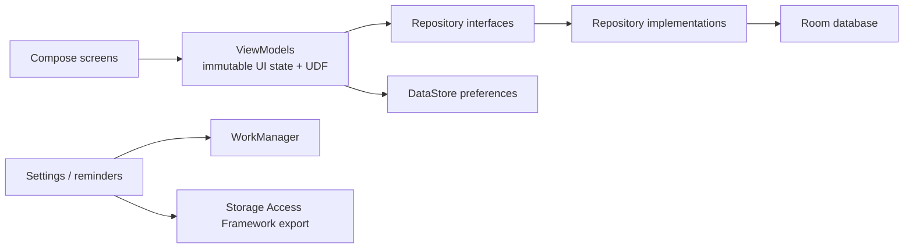

# Pennywise
> A production-style, offline-first Android expense tracker built with Kotlin, Jetpack Compose, and a local-first architecture.

## Overview
Pennywise is a modern personal finance app focused on clarity, trust, and maintainability. It helps a single on-device user track income and expenses, manage budgets, review spending trends, organize categories and accounts, and export their data without depending on a backend.

This project exists as a portfolio-grade Android codebase rather than a tutorial CRUD sample. The emphasis is on real local persistence, predictable state management, safe money handling, thoughtful UX, and code organization that is easy to discuss in an interview.

## Feature Highlights
### Transactions
- Add and edit `expense` and `income` transactions
- Capture amount, category, account, payee, note, tags, and date
- Delete with undo and duplicate an existing transaction
- Search by note, payee, or category
- Filter by type, category, account, and date range
- Save reusable filter presets for frequently used views
- Browse transactions grouped by day

### Dashboard
- First screen after onboarding with a current-month overview
- Monthly income, expense, and remaining budget summary cards
- Top spending categories surfaced as a chart
- Recent transactions preview
- Quick actions for new expense, income, budgets, and reports
- Recurring transaction catch-up prompt when due items exist

### Budgets
- Monthly total budgets and category-specific budgets
- Progress indicators with on-track / warning / over-limit states
- Rollover flag stored per budget
- Month switching to review previous or upcoming budget windows
- Budget visibility can be turned on or off in settings

### Reports
- Spending by category
- Income vs expense monthly trend
- Budget adherence summary for the active report window
- Range presets for month, quarter, and year
- Reports are backed by repository/database aggregations, not mocked UI data

### Categories and Accounts
- Seeded default expense and income categories
- Custom category CRUD with emoji and color support
- Safe category deletion with reassignment when transactions already use that category
- Multiple accounts with derived balances
- Account archiving support
- Account deletion guard when transactions still reference the account

### Recurring, Export, and Settings
- Recurring transaction templates for daily, weekly, and monthly patterns
- Manual “apply due items” flow for recurring entries, plus due-item catch-up during app bootstrap
- CSV export and JSON backup using the Storage Access Framework
- Theme mode: system, light, dark
- Currency, first day of week, budgets, haptics, and reminder preferences
- Optional daily expense reminder powered by WorkManager and notification permission handling on newer Android versions

## Screenshots
No product screenshots are committed in the repository yet. Add real device captures here before publishing the portfolio repo.

| Screen | Status |
| --- | --- |
| Dashboard | TODO: add screenshot |
| Transactions | TODO: add screenshot |
| Budgets | TODO: add screenshot |
| Reports | TODO: add screenshot |
| Settings | TODO: add screenshot |

## Tech Stack
- Kotlin
- Jetpack Compose
- Material 3
- Navigation Compose with typed `@Serializable` routes
- Android ViewModel
- Kotlin Coroutines + Flow
- Hilt
- Room
- DataStore Preferences
- WorkManager
- Kotlinx Serialization
- Timber
- JUnit 4
- MockK
- Turbine
- Compose UI Test
- Android instrumented tests
- Detekt
- Spotless + Ktlint
- Gradle version catalog

## Architecture
Pennywise is currently a single-module app, but it is organized with clear internal boundaries so the codebase can scale without collapsing into a giant activity or a giant UI package.



### How responsibilities are split
- `feature/*`: screen-specific UI and ViewModels
- `core/*`: shared models, theme, UI building blocks, money/date helpers
- `domain/repository`: contracts consumed by ViewModels
- `data/*`: Room entities, DAOs, mappers, repositories, export logic, seed data
- `navigation/*`: typed routes and top-level destination wiring
- `di/*`: Hilt modules
- `work/*`: reminder scheduling and worker implementation

### Practical architecture decisions
- Composables render state and forward events; business rules live outside the UI layer.
- Screen state is exposed as immutable `StateFlow` and collected with lifecycle-aware APIs.
- Repository implementations own query composition, aggregation, export, and recurring application logic.
- Money is stored as `Long` minor units and only formatted at the edges to avoid floating-point issues.
- Room schema export is enabled, and a `1 -> 2` migration is checked in under [`app/schemas`](/Users/yusufjonaxmedov/Desktop/Pennywise/app/schemas).
- The domain layer is intentionally thin: repository interfaces add real value, while complex calculations stay close to the data they depend on.

## Project Structure
```text
Pennywise/
├── app/
│   ├── schemas/
│   └── src/
│       ├── main/
│       │   ├── java/com/yusufjonaxmedov/pennywise/
│       │   │   ├── core/
│       │   │   ├── data/
│       │   │   ├── di/
│       │   │   ├── domain/
│       │   │   ├── feature/
│       │   │   ├── navigation/
│       │   │   ├── work/
│       │   │   ├── MainActivity.kt
│       │   │   ├── PennywiseApp.kt
│       │   │   ├── PennywiseAppViewModel.kt
│       │   │   └── PennywiseApplication.kt
│       │   └── res/
│       ├── test/
│       └── androidTest/
├── config/
│   └── detekt/
├── gradle/
│   ├── libs.versions.toml
│   └── wrapper/
├── build.gradle.kts
├── gradle.properties
└── settings.gradle.kts
```

## What Makes This Production-Style
- Local-first by default: Room + DataStore hold the primary source of truth, and no cloud backend is required.
- Safe money model: amounts are parsed and stored in minor units instead of `Double`.
- Real persistence concerns: schema export, migration support, indexed tables, and seeded defaults are included.
- UX is more than CRUD: dashboard summaries, reusable filters, reports, reminders, export flows, and recurring templates all exist in the product.
- Deletion safeguards are explicit: categories can reassign dependent transactions, and accounts with history must be archived instead of removed.
- Quality tooling is part of the repo: Detekt, Spotless, Android lint, unit tests, Room tests, and Compose UI coverage are wired into Gradle.

## Getting Started
### Prerequisites
- Android Studio with an installed Android SDK
- JDK 17
- Android SDK platform matching `compileSdk = 36`

### Build the app
```bash
./gradlew :app:assembleDebug
```

### Run the app
Open the project in Android Studio and launch the `app` configuration on an emulator or physical device running Android 8.0+ (`minSdk 26`).

## Testing
### Included test coverage
- Money parsing and formatting
- Budget progress/status calculation
- Transaction query generation for compound filters
- Onboarding ViewModel state persistence
- Transactions ViewModel search/delete/restore behavior
- Room integration coverage for derived account balances
- Compose UI smoke coverage for the onboarding flow

### Run tests
```bash
./gradlew :app:testDebugUnitTest
./gradlew connectedDebugAndroidTest
```

Connected tests require an emulator or physical device.

## Quality and CI
### Quality gates available locally
```bash
./gradlew qualityCheck
```

`qualityCheck` aggregates:
- `:app:detekt`
- `:app:lintDebug`
- `:app:testDebugUnitTest`

Formatting is handled through Spotless:

```bash
./gradlew spotlessCheck
./gradlew spotlessApply
```

GitHub Actions workflow files are not committed yet. The repository is already set up with a clear CI entry point through `qualityCheck`, so adding a workflow on top of it is straightforward.

## Privacy and Data Handling
- Pennywise is local-only by design.
- The app does not include network sync, cloud auth, or third-party analytics SDKs.
- Financial data stays on-device unless the user explicitly exports it.
- Exports use Android’s document APIs instead of broad storage permissions.
- Notification permission is requested only when the user enables reminders on supported Android versions.

## Current Scope and Honest Notes
- Transaction types currently cover `expense` and `income`; transfers are not implemented.
- Export is implemented for CSV and JSON backup; import/restore is not implemented yet.
- Reports use practical range presets (`month`, `quarter`, `year`) instead of arbitrary custom date picking.
- Screenshot assets and GitHub Actions workflow files are still missing from the repo.

## Roadmap
- Add a GitHub Actions workflow for build, quality, and test automation
- Capture polished screenshots and add them to the README
- Expand connected UI coverage for multi-screen flows
- Add import/restore support with validation and duplicate handling
- Add transfer transactions and richer reporting/filter presets
- Consider biometric/PIN app lock if privacy scope grows

## Why This Repo Is Useful In An Interview
- It demonstrates modern Android app architecture without unnecessary architecture theater.
- It shows practical use of Room, DataStore, WorkManager, Compose, Flow, and Hilt in the same app.
- It includes real data modeling decisions around money, filtering, recurring transactions, and local-only privacy.
- It is small enough to understand in one sitting, but broad enough to discuss tradeoffs, testing, and maintainability.
